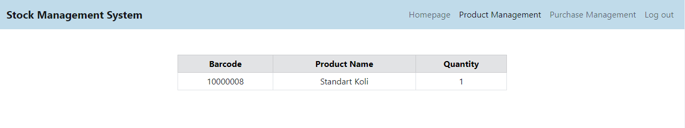
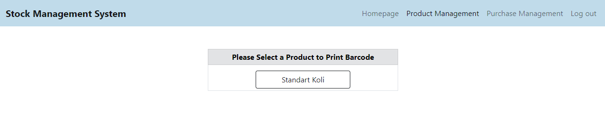
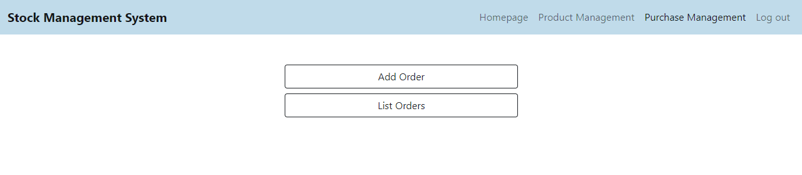
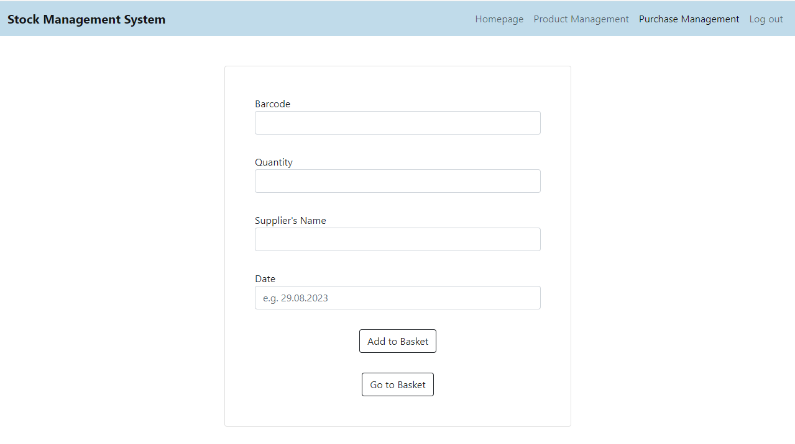
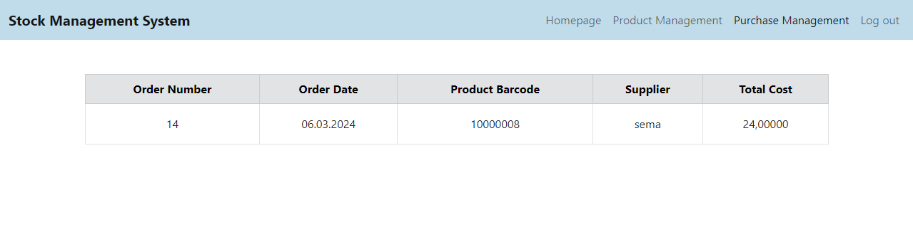

# STOCK MANAGEMENT SYSTEM
## General Features of the Project
In this project, a website has been created where companies can track their products, orders and stocks. The project has 4 main modules: Homepage, Product Management, Purchase Management and User Management. The submodules that take part in this modules are listed below:

**1.** Product Management
- Add Product
- List Products 
- Show Stock
- Print Barcode
  
**2.** Purchase Management 
- Add Order 
  - Add Product to Basket 
  - Show Basket
- List Orders
  
**3.** User Management
- Log In
- Sign In

## Technologies Used in the Project
Java programming language was used for the project. JSP (Java Server Pages) pages were used in the frontend. With the Servlet structure, information and actions coming from JSP pages are managed. PostgreSQL was used for database management. Tomcat web server was used to run the project as a web project. 

## Environment Prepared for the Development and Running of the Project
Apache Tomcat was installed on the computer firstly. Tomcat is defined as a web server that enables running Java EE specifications. Java Servlet and JSP are contained in the Java EE specifications.  

After Tomcat installation, server configuration was made on Eclipse IDE. In order to code and run a web project on Eclipse, the “Web, XML, Java EE and OSGi Enterprise Development” plugin was downloaded from the Install New Software section. After all this, a project file was created by creating a Dynamic Web Project via Eclipse. Then the project was converted to Maven project. Then the coding phase was started for the project.

## User Interface Screenshots
### 1. Homepage

If the user is not logged in, the user cannot access the Product Management and Purchase Management pages. When the user clicks on these pages, the User Management page is displayed. There are login and registration options on this page.

### 2. User Management Pages

#### Log In

#### Sign In

### 3. Product Management Pages

#### Add Product

#### List Products

#### Product Details

#### Show Stock

#### Print Barcode

### 4. Purchase Management Pages

#### Add Order

#### List Orders

