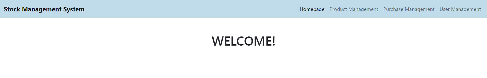
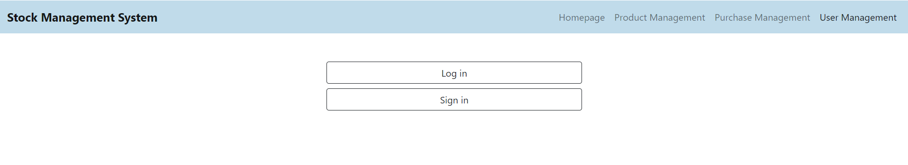
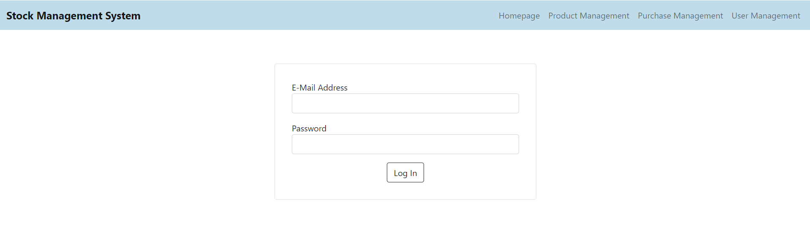
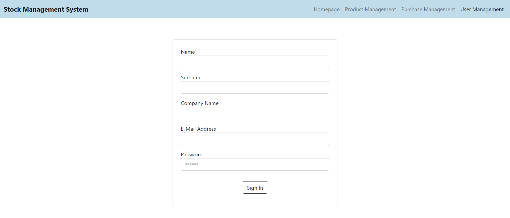
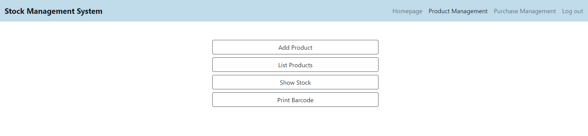
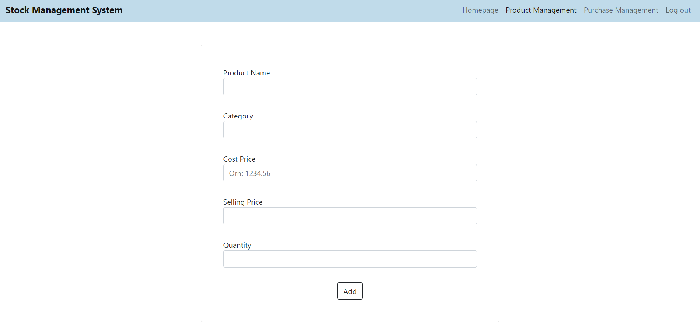
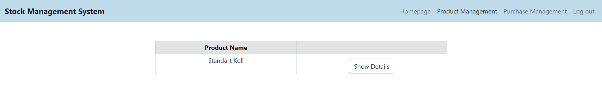
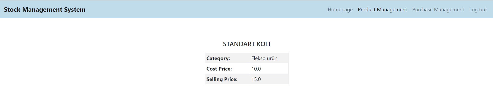

# STOK TAKİP SİSTEMİ
## Projenin Genel Özellikleri
Bu projede, firmaların ürün, sipariş ve stok takibi yapabilecekleri bir web sitesi oluşturulmuştur. Projede Anasayfa, Ürün Yönetimi, Satın Alma Yönetimi ve Kullanıcı Yönetimi modülleri bulunmaktadır. Bu modüllerde bulunan alt modüller aşağıda listelenmiştir.

**1.** Ürün Yönetimi
- Ürün Ekleme
- Ürün Listeleme 
- Stok Görüntüleme
- Barkod Yazdırma
  
**2.** Satın Alma Yönetimi 
- Sipariş Oluşturma 
  - Sepete Ürün Ekleme 
  - Sepeti Görüntüleme
- Sipariş Listeleme
  
**3.** Kullanıcı Yönetimi
- Giriş Yapma
- Kaydolma

## Projede Kullanılan Teknolojiler
Projede Java programlama dili kullanılmıştır. Frontend kısmında JSP sayfaları kullanılmıştır. Servlet yapısıyla JSP sayfalarından gelen bilgiler ve hareketler yönetilmiştir. Veri tabanı yönetimi için PostgreSQL kullanılmıştır.
Projenin web projesi olarak çalıştırılması için Tomcat web server kullanılmıştır.

## Projenin Geliştirilmesi ve Çalıştırılabilmesi için Hazırlanan Ortam
Öncelikle bilgisayara Apache Tomcat uygulaması kurulmuştur. Tomcat, Java EE spesifikasyonlarını çalıştırmayı sağlayan bir web server olarak tanımlanır. Bunlar arasında Java Servlet ve Java Server Pages (JSP) yer almaktadır. Yapılacak olan projede kullanılacak olan uygulamalar da bunlardır. 

Tomcat kurulumu sonrası Eclipse IDE üzerinde server konfigürasyonu yapılmıştır. Eclipse üzerinden web projesi yazmak ve çalıştırmak için Install New Software kısmından “Web, XML, Java EE and OSGi Enterprise Development” eklentisi indirilmiştir. Bu işlemlerin ardından Eclipse üzerinden Dynamic Web Project oluşturularak proje dosyası oluşturulmuştur. Daha sonra proje Maven projesine çevrilmiştir. Ardından proje için kodlama aşamasına geçilmiştir.

## Kullanıcı Arayüzü Ekran Görüntüleri
### Anasayfa

Kullanıcı giriş yapmadıysa, Ürün Yönetimi(Product Management) ve Satın Alma Yönetimi(Purchase Management) sayfalarına erişememektedir. Bu sayfalara tıkladığında karşısına Kullanıcı Yönetimi(User Management) sayfası çıkmaktadır. Bu sayfada giriş yapma ve kaydolma seçenekleri bulunmaktadır.

### Kullanıcı Yönetimi

### Giriş Yapma Sayfası

### Kaydolma Sayfası

### Ürün Yönetimi Sayfası

### Ürün Ekleme Sayfası

### Ürünleri Listeleme Sayfası

### Detayları Göster Seçeneği Seçilirse

